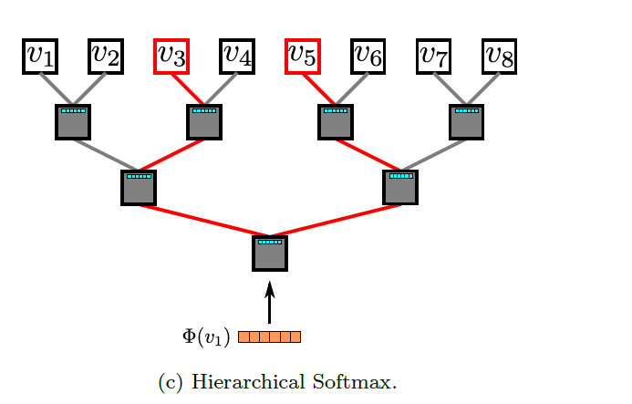

# DeepWalk: Online Learning of Social Representations

给后来者：本笔记用来帮助同学们了解DeepWalk论文，**遵循[Mozilla Public License 2.0](https://www.mozilla.org/en-US/MPL/2.0/)协议** ，本部分的 `作者`和 `修改人`信息请保留，后面任何内容请后来者按照认为最合适的方式排布、修改。

* 笔记作者：赵敬业
* 修改人：

## 符号和术语

这里展示可能让人记不住的符号和术语，通用符号和烂大街的术语不做说明，这是一些直观说明，请不要写到论文里。

* relational classification(collective classification):关系分类，指的是将实体之间的关系分类为不同类型的问题。这是一个NP难问题，也是本文用来展示DeepWalk有效性的问题。
* representaion problem: 表示学习。指从图的连接信息中创造一些特征出来。图嵌入就是表示学习。
* approximate inference techniques: 近似推断方法，似乎和概率图模型有关系，这些方法包括变分推理、蒙特卡洛、马尔科夫链蒙特卡洛法、吉布斯采样等。
* $G_L=(V, E, X, Y)$:部分有标签的社交网络，V是节点、E是连接、$X \in R^{|V|\times S}$ 是每节点的特征，$Y\in R^{|V|\times|\mathcal{Y}|}$是节点的标签
* $X_E \in \mathbb{R}^{|V| \times d}$：本文学习的目标，d是一个很小的维度。
* Power laws: 幂律分布。这是一种概率分布，真实世界中的网络节点度喜欢服从这种分布，只有极少数的节点连接数非常大，大部分节点连接数非常小。
* 迭代近似推断算法：一类用于近似计算后验分布的算法，通常用于处理复杂的图形模型。其中，迭代分类算法是一种特定的迭代近似推断算法，用于处理分类问题。吉布斯采样也是一种常用的迭代近似推断算法。

## Deepwalk思想

* 首个将深度学习和自然语言处理用于图机器学习。
* 解决的问题：图嵌入(embedding)问题，即把一个节点稀疏向量压缩映射成一个低维稠密向量，并且向量反应原始节点关系。
  * 这个向量可以作为之后机器学习的特征输入。主要是传统机器学习非常害怕维度爆炸，这样特征工程做下来就很好。
  * 这种方法也可以算作是表示学习(Representation Learning)
* 套用Word2Vec方法，通过随机游走，可以学习到网络的连接结构信息。
* 这是一种自监督学习方法。不需要本科生来标数据了！

## 传统方法的问题

* 最普通的机器学习方法一般认为样本点是独立同分布的，但是在图中不是如此，节点之间有很大的联系。
* 之前的研究把这种图数据的分类问题称为关系分类(或集体分类)。传统把这个建模成无向马尔可夫网络，用迭代近似推断方法解决上面的问题，但是这些传统方法似乎都用到了标签信息，具体的方法如下

  * 吉布斯采样
  * 迭代分类算法
  * 标签松弛

## DeepWalk优势

* 可以反映社群的聚集信息。也就是谁和我离得近一目了然。
* 不需要标签信息。稀疏标注的场景下表现非常好，即标注很少的情况下，表现非常好。
* 训练时不用特征信息，生成的新特征基本和标签没有关系。
* 在线学习，即来即训。因为训练时只使用部分信息，不使用全局信息。
* 可以并行学习。
* 生成的特征维度低。

## 算法

### DeepWalk算法总览

1. 输入一个图。随机初始化$\Phi$矩阵,其形状$|V|\times d$
2. for i = 0 : $\gamma$   (循环$\gamma$次，也就是模型运行$\gamma$个epoch)

   1. 打乱所有节点的序号，为了之后随机游走更随机一点。
   2. for $v_i \in V$ (遍历所有节点，其实就是随机梯度下降的遍历所有样本,作者这符号真混乱，上面用i这里还用i)
      1. 对这个节点产生一个随机游走序列 $\mathcal{W_{vi}} = RandomWalk(G,v_i,t)$
      2. 根据上一步的随机游走序列，进行更新$\Phi$的操作，具体怎么更新见后面的说明3和说明4
3. 输出$\Phi$矩阵

### 算法说明1--随机游走

这里先介绍随机游走，再介绍目标函数，因为目标函数的构建依赖于随机游走这个方法。

随机游走很简单，从一个节点$v_i$（这里也记作$\mathcal{W}_{v_i}^1$）出发，每次都随机跳转到下一个节点，一直走直到经过了t个节点，产生一个序列$\mathcal{W}_{v_i}^1, \mathcal{W}_{v_i}^2, \ldots, \mathcal{W}_{v_i}^k$就是随机游走序列$\mathcal{W}_{v_i}$。

随机游走的好处

* 保留了原始图中的结构信息。比如社交网络、自然产生的图一般都服从幂律分布，随机游走产生的图也是幂律分布。
* 可以并行。
* 可以在线学习。因为用的不是全图信息，即使新来一些节点，我再多随机走两步就有了。

### 算法说明2--目标函数

本文是要学一个表示矩阵 $X_E \in \mathbb{R}^{|V| \times d}$。这里变换的函数是$\Phi(*)$,也就是比如说$v_i$的表示向量就是$\Phi(v_i)$，表示矩阵$X_E=\Phi(V)$。本文简单假设$\Phi$就是表示矩阵$X_E$，此时 $\Phi(v_i)$是$\Phi$矩阵的第i行。表示向量长度$d$。

本文的目标函数是最大似然估计某个值。但是在此有两种不同的思路，如下文所示。

一种传统的想法是用随机游走的前i-1个值来预测第i个值，目标是使如下面的公式所示的概率尽量大。

$$
\operatorname{Pr}\left(v_i \mid\left(\Phi\left(v_1\right), \Phi\left(v_2\right), \cdots, \Phi\left(v_{i-1}\right)\right)\right)
$$

但是这个公式大概有两个问题（思想不成熟，欢迎指正）：

* 图中的节点临近关系大概是没什么顺序性的，但是在这里似乎用到了顺序的信息，也就是节点出现的位置会对我的预测产生影响。
* 随机游走长度变长，则可能输入的节点会变多，那么计算量可能就太大了。

因此，这里使用一种不传统的目标函数，就是用一个节点来预测哪些临近节点，可以有效克服这上面的问题。此时目标函数可以表示成下面的公式：

$$
\underset{\Phi}{\operatorname{minimize}} \quad-\log \operatorname{Pr}\left(\left\{v_{i-w}, \cdots, v_{i-1}, v_{i+1}, \cdots, v_{i+w}\right\} \mid \Phi\left(v_i\right)\right)
$$

### 算法说明2--SkipGram更新参数

对随机游走序列中的每一个节点，寻找他前后w个节点，估计其对数似然值，然后按照某种步长来梯度下降，也就是要在这里最大化我这个表示向量参数估计我周围节点的概率。

| Algorithm 2 SkipGram$\left(\Phi, \mathcal{W}_{v_i}, w\right)$                       |
| :------------------------------------------------------------------------------------ |
| 1: for each$v_j \in \mathcal{W}_{v_i}$ do                                           |
| 2:$\quad$ for each $u_k \in \mathcal{W}_{v_i}[j-w: j+w]$ do                       |
| 3:$\quad J(\Phi)=-\log \operatorname{Pr}\left(u_k \mid \Phi\left(v_j\right)\right)$ |
| $4: \quad \Phi=\Phi-\alpha * \frac{\partial J}{\partial \Phi}$                      |
| 5: end for                                                                            |
| 6: end for                                                                            |

### 算法说明3--Hierarchical Softmax

具体怎么算对数似然函数是本算法可能的计算量最大的一部分，因此有必要进行优化来提高效率。

传统的方法是用softmax函数,下面列出的是笔者认为的SkipGram函数

$$
p(u_k \mid \Phi(v_j))=\frac{\exp \left(\Phi(v_j)^{\top} \Phi(u_k)\right)}{\sum_{v_i \in V} \exp \left(\Phi(v_j)^{\top} \Phi(v_i)\right)}
$$

这里用的是Hierarchical Softmax函数，

以根节点上面的其中一个子节点的概率计算为例，其计算公式如下：

$$
p(node1 \mid \Phi(v_j))=\frac{\exp \left(\Phi(v_j)^{\top} \Phi(node1)\right)}{\sum_{v_i \in \{node1,node2\}} \exp \left(\Phi(v_j)^{\top} \Phi(v_i)\right)}
$$

因此，计算任何一个叶子节点，只需要如下公式

$$
\operatorname{Pr}\left(u_k \mid \Phi\left(v_j\right)\right)=\prod_{l=1}^{\lceil\log |V|\rceil} \operatorname{Pr}\left(b_l \mid \Phi\left(v_j\right)\right)
$$

这个函数有两个好处，

* 时间复杂度：计算量可以降到$2log_2 |V|$ ，这比softmax 需要|V|的计算量一般要小。
* 空间复杂度：原来有|V|个节点，现在有|V|-1个节点，保持不变。

## 算法变种

* Streaming——在线方法。
* 不那么完全随机。就是随机游走过程可以加入某些先验知识。

## 读完之后的问题和想法

一些无关紧要的问题

* 不知道有没有节点不相关的假设，否则那个skipGram就挺突兀
* 哪些传统方法到底是啥？

这篇论文读下来没有给我一种我上我也行的感觉。我没有来得及拜读Word2Vec那篇文献，因此后面的总结可能是错误的，但是无所谓，这里只是想讨论核心的创新点在哪里，与到底是哪篇文章提出来无关。给我一张图，我想把节点连接的信息表示出来，而且是用一个特征向量来表示节点连接信息，这个特征向量得能表示哪个节点离得我这个节点近。那我得用数学的语言把我的想法说一说，我得先定义说怎么用特征向量表示哪个节点离我这个节点近，一种简单的思路是内积大就可以表示我这个节点离得近，然后用一个softmax函数把我们两个内积比别人大，具体大多少更方便的量化出来。下面就还剩两个问题需要解决：

* 怎么优化？分两步：

  1. 我好歹能先算出来现在的特征向量下的概率计算出来
  2. 我应该告诉模型，实际上的概率应该是什么样的，也就是我应该告诉模型，我认为这两个节点出现的概率应该是什么样的，这就变成了一个怎么度量实际上的近和远的问题。
* 我怎么知道这个图中哪些节点离着我近？或者说离我近这个东西本身就很难定义成很好的反应人们的期望的，简单地说我周围一圈的节点离我近或者周围两圈的节点离我近失偏颇的，我认为随机游走的性质应该在之前已经被研究很多了，可能就是作者认为随机游走比较理想的原因，它满足了人们对于离的近的一种定义。之前单纯的随机游走是度量度中心性的，这里改造成度量‘离得近’这样一种方法。

## 参考

[关于Softmax和Hierarchical Softmax](https://www.ruder.io/word-embeddings-softmax/#:~:text=Hierarchical%20softmax%20(H%2DSoftmax),be%20seen%20in%20Figure%201.)
