# GAT

## 目录

- [GAT](#gat)
  - [目录](#目录)
- [简介](#简介)
- [图注意力层](#图注意力层)
- [多头注意力](#多头注意力)
- [效果](#效果)
- [结论](#结论)
- [常用数据集](#常用数据集)
  - [KarateClub](#karateclub)
  - [cora](#cora)
  - [PPI](#ppi)
  - [TUDataset](#tudataset)
- [OGB](#ogb)
- [疑问](#疑问)

一层GNN有如下构成

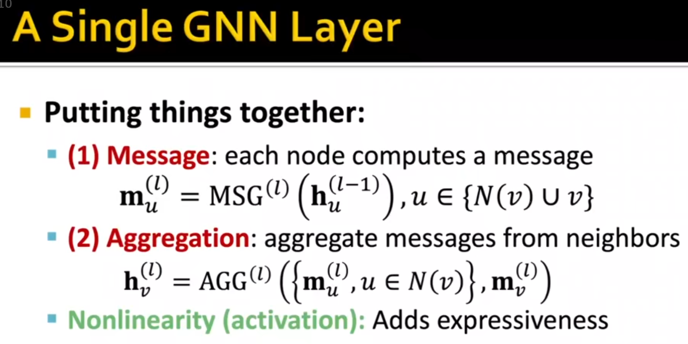

GCN

GraphSAGE

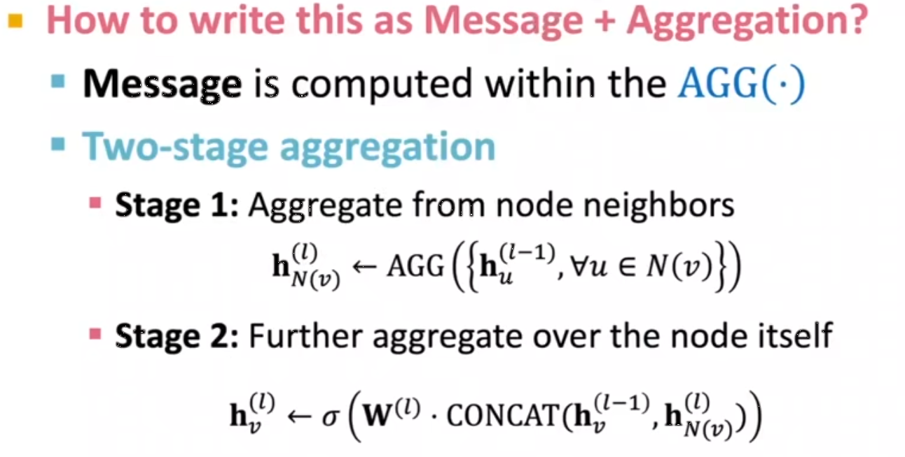

GAT

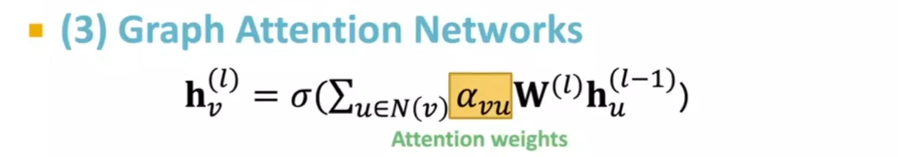

# 简介

-   GAT，全称Graph Attention Network，是一种图神经网络。这种网络的核心思想是在节点的更新中引入注意力机制，自适应地学习不同的邻居节点对中心节点的贡献。
-   传统的图神经网络（如GCN）在更新节点特征时，会对邻居节点的特征进行**等权重的平均**，这样做虽然简单但是**忽略了不同邻居节点对中心节点的影响是不同的**。相比之下，GAT通过注意力机制赋予不同邻居节点**不同的权重**，使得模型能够在特征更新中更好地把握节点间的依赖关系。As opposed to GCNs, our model allows for (implicitly) **assigning different importances to nodes of a same neighborhood**, enabling a leap in model capacity.
-   GAT的主要操作步骤大致如下：
    1.  首先，使用一个可学习的权重矩阵将每个节点的特征投影到一个更高的表示空间中。
    2.  然后，为每一对邻居节点计算一个注意力评分，该评分代表了一个节点对另一个节点的重要性。计算评分的公式通常是一个小型的神经网络，它接受两个节点的特征并输出一个标量值。
    3.  之后，对所有邻居节点的注意力评分进行归一化，这通常使用softmax函数完成，确保所有的评分之和为1。
    4.  最后，用归一化后的注意力评分对邻居节点的特征进行加权求和，得到新的节点特征。
-   GAT的一个主要优点是它能够更准确地捕获节点间的复杂关系，并且在计算复杂度上仍然保持在可接受的范围内。同时，GAT不需要知道图的全局信息，也就是说，它可以适应任何结构的图。

# 图注意力层

图注意力层（Graph Attention Layer）的核心公式主要包括两部分：注意力权重的计算和特征更新。

1.  注意力系数（未归一化）计算：首先，定义一个注意力机制 $a$，这通常是一个可学习的小型神经网络，它接收两个节点的特征并输出一个标量。给定一个中心节点 $i$和它的邻居节点$  j $，我们可以计算这两个节点之间的**原始注意力分数**为：

    $$
    e_{i j}=a\left(\mathbf{W} \vec{h}_{i}, \mathbf{W} \vec{h}_{j}\right)
    $$
    -   其中 $W$ 是一个可学习的权重矩阵，它被用来将输入特征 $ h  $进行线性变换。然后通过$  a $ 计算节点 $ i  $和节点$  j $ 的关系强度。
    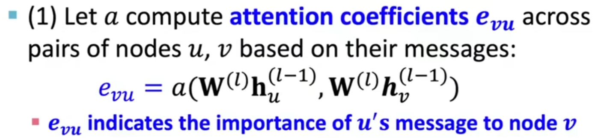
    -   怎么合并呢？
    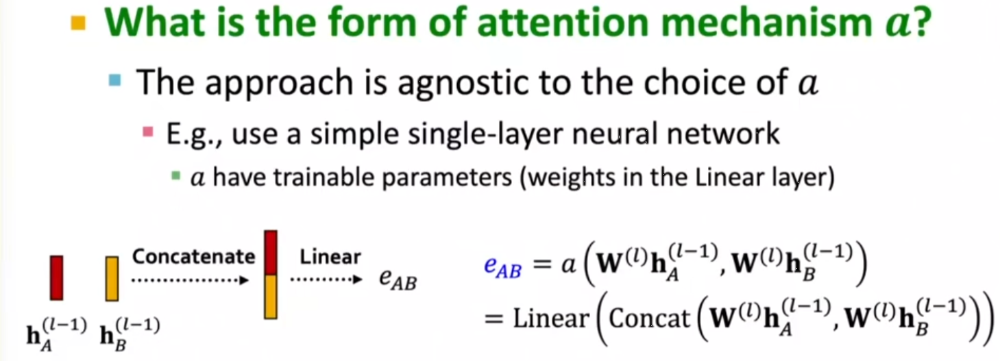
    -   多头注意力怎么设置呢？
    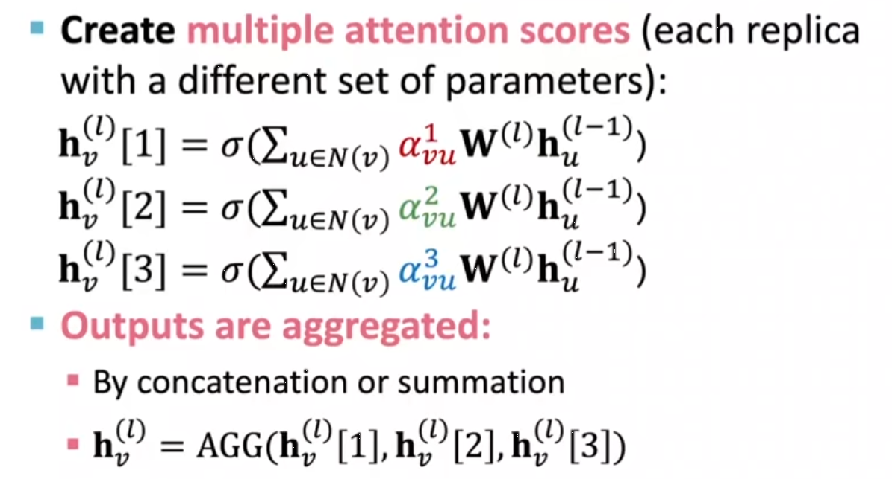
2.  注意力（归一化）计算：我们希望得到的注意力分数是归一化的，即每个节点的所有邻居节点的分数总和为 1。这可以通过 softmax 函数实现：

    $$
    \alpha_{i j}=\operatorname{softmax}_{j}\left(e_{i j}\right)=\frac{\exp \left(e_{i j}\right)}{\sum_{k \in \mathcal{N}_{i}} \exp \left(e_{i k}\right)}
    $$
    -   其中$  N(i)  $是节点 i 的邻居节点集合。
    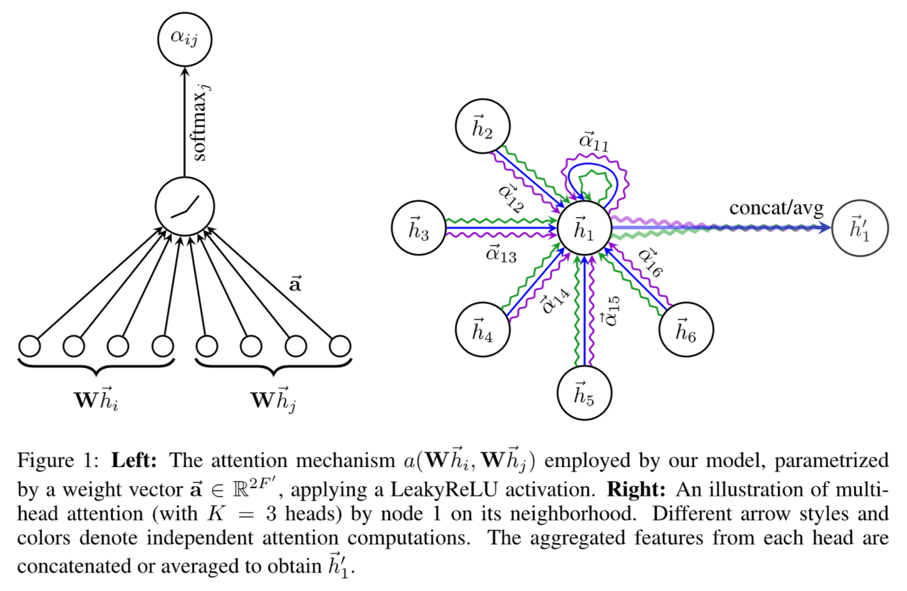
    -   最终表达式：
    $$
    \alpha_{i j}=\frac{\exp \left(\operatorname{LeakyReLU}\left(\overrightarrow{\mathbf{a}}^{T}\left[\mathbf{W} \vec{h}_{i} \| \mathbf{W} \vec{h}_{j}\right]\right)\right)}{\sum_{k \in \mathcal{N}_{i}} \exp \left(\operatorname{LeakyReLU}\left(\overrightarrow{\mathbf{a}}^{T}\left[\mathbf{W} \vec{h}_{i} \| \mathbf{W} \vec{h}_{k}\right]\right)\right)}
    $$
3.  最后，我们可以用这个归一化的注意力分数对邻居节点的特征进行加权求和，得到新的节点特征：

    $$
    \vec{h}_{i}^{\prime}=\sigma\left(\sum_{j \in \mathcal{N}_{i}} \alpha_{i j} \mathbf{W} \vec{h}_{j}\right)
    $$
    -   这个公式的含义是，新的节点特征是邻居节点特征的加权平均，权重由注意力机制确定，反映了邻居节点对中心节点的重要性。

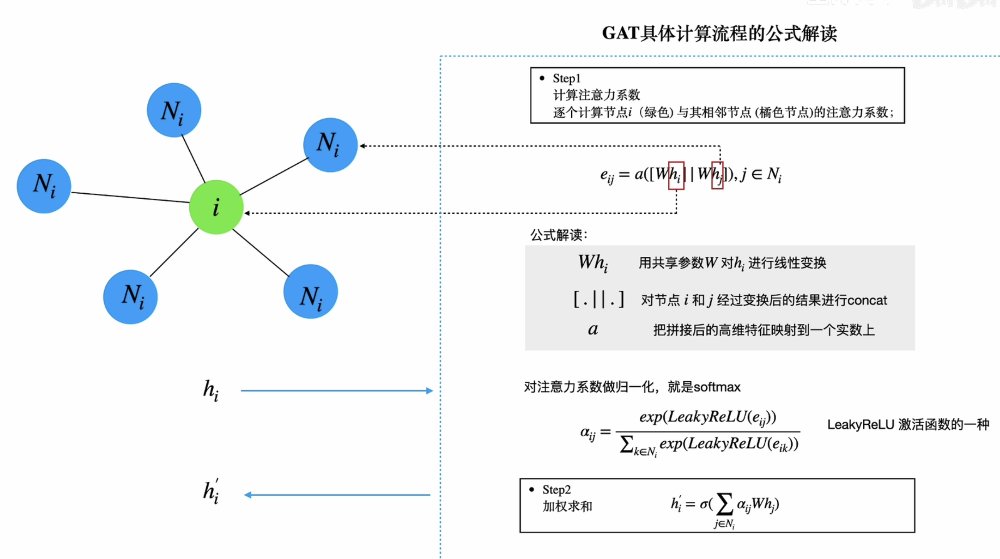

这种使用注意力机制的方式能够更准确地捕获图中的节点间关系，尤其是当图的结构较复杂时。同时，由于注意力机制的引入，模型可以自适应地学习邻居节点对中心节点的贡献，而不是简单地等权重地处理所有邻居节点。

# 多头注意力

-   在GAT中，多头注意力机制的处理方式是对同一节点进行多次不同的注意力计算，就像在自然语言处理中的 Transformer 模型那样。
-   这种方法的优点是能够捕捉到更多复杂和丰富的节点间的关系。因为每一个头（head）可能会学习到不同的注意力权重，从而关注到不同的邻居节点，或者同样的邻居节点的不同特性。
-   具体实现上，对于一个图注意力层，可以有 $K$ 个独立的头。每一个头都有自己的参数（例如线性转换的权重矩阵 $W$ 和注意力机制$  a $）。我们对每一个头都进行独立的注意力计算，得到$  K  $个新的节点特征集合 ${h_i'^1, h_i'^2, ..., h_i'^K}$。
-   然后，有两种常见的方式来整合这些头的输出：
    1.  平均：将 $K$ 个头的输出求平均，得到最终的节点特征。这种方式保留了所有头的信息，但可能会导致某些重要的信息被稀释。

        $$
        \vec{h}_{i}^{\prime}=\sigma\left(\frac{1}{K} \sum_{k=1}^{K} \sum_{j \in \mathcal{N}_{i}} \alpha_{i j}^{k} \mathbf{W}^{k} \vec{h}_{j}\right)
        $$
    2.  拼接（concatenation）：将 $K$ 个头的输出拼接在一起，得到最终的节点特征。这种方式能够更好地保留每个头的信息，但会增加特征的维度，可能导致计算复杂度增大。

        $$
        \vec{h}_{i}^{\prime}=\|_{k=1}^{K} \sigma\left(\sum_{j \in \mathcal{N}_{i}} \alpha_{i j}^{k} \mathbf{W}^{k} \vec{h}_{j}\right)
        $$
    3.  **在 GAT 的原始论文中，作者在除最后一层外的所有层中采用拼接的方式，而在最后一层中采用平均的方式，以保持输出特征的维度不变。**
-   这种多头注意力机制使得 GAT 能够在捕捉图结构信息的同时，也能捕捉到更复杂的节点间关系。

# 效果

数据集

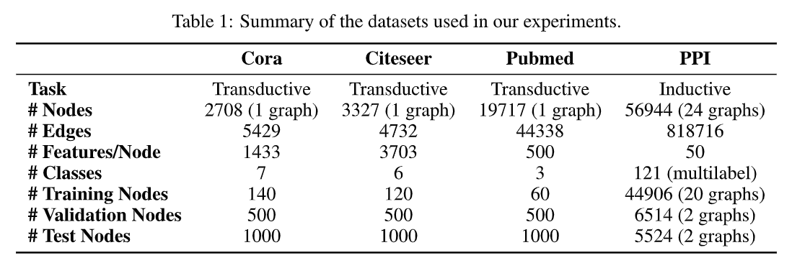

设置

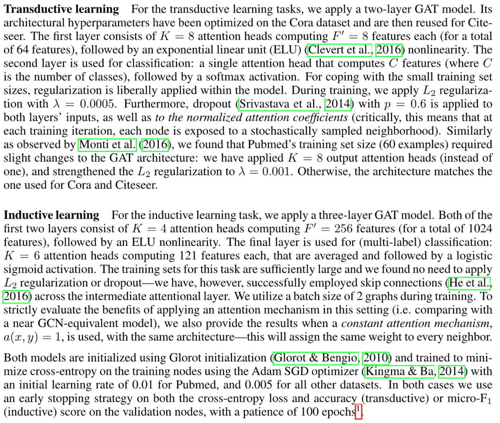

效果

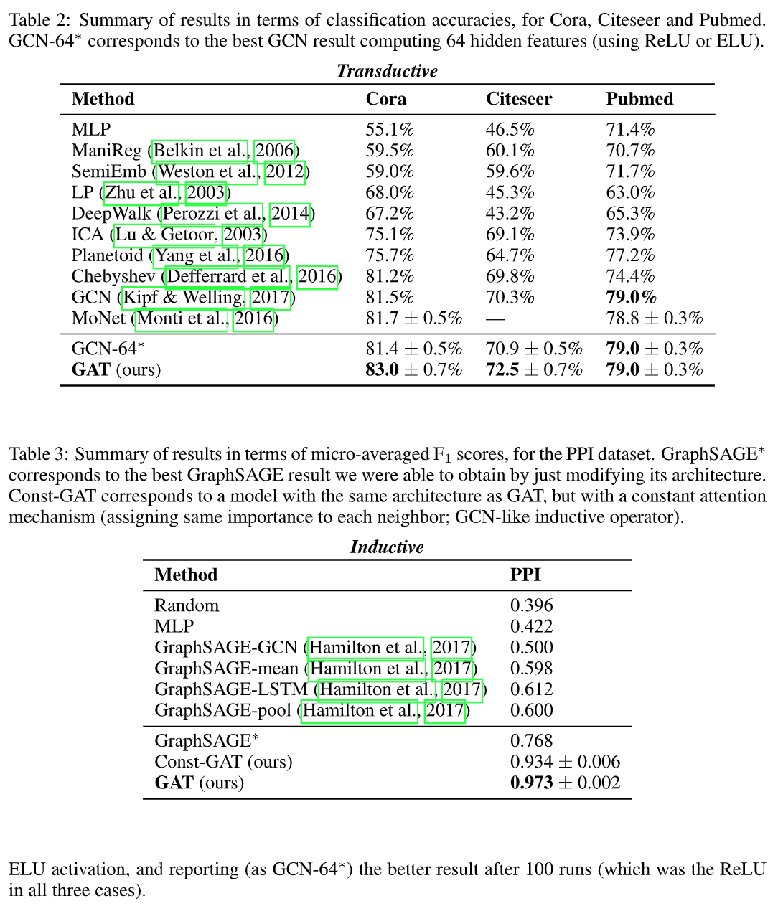

# 结论

# 常用数据集

## KarateClub

Karate Club数据集是一种经典的社交网络数据集，常用于图神经网络（Graph Neural Networks，GNN）和社区发现的研究中。这个数据集反映了一个真实的社交网络，即Zachary的空手道俱乐部。

Karate Club数据集由34个节点组成，这些节点代表了空手道俱乐部中的成员，包括俱乐部教练和学生。数据集中的每条边表示两个成员之间的社交关系，例如他们之间的交流、合作等。

Karate Club数据集的特点是存在一个明显的社区结构，即俱乐部的分裂。在数据集中，一个有争议的事件导致了空手道俱乐部的分裂成两个小团体，分别由俱乐部教练和一部分学生组成。这种分裂在数据集中反映为两个明确的社区，即两个密切相关的子群。

Karate Club数据集通常用于社区发现的任务，即从网络中识别出具有紧密联系的子群。通过使用GNN模型和相关的图算法，研究人员可以探索该数据集中的社区结构，并尝试使用GNN来预测成员的社区归属，评估社区检测算法的性能等。

Karate Club数据集因其简单性和具有挑战性的社区结构而成为图神经网络领域的一个流行的基准数据集之一。它可以用于学术研究、模型开发和算法验证等目的。

## cora

Cora数据集是一个经常在图神经网络（Graph Neural Networks，GNN）研究中使用的常见数据集之一。它是一个用于节点分类任务的引文网络数据集。

Cora数据集涉及到论文的引用关系。它由2708篇机器学习论文组成，这些论文分属于7个不同的机器学习研究领域（类别）。这些领域包括自然语言处理、数据库、人工智能等。数据集中的每个节点表示一篇论文，并具有以下特征：

-   文本特征：每篇论文被表示为一个词袋模型（bag-of-words），其中每个词对应于论文中的单词。特征向量的每个元素表示相应词汇在论文中的出现频率。
-   引用关系：节点之间的边表示论文之间的引用关系。如果一篇论文引用了另一篇论文，它们之间就会存在一条有向边。

Cora数据集的任务是对每篇论文进行分类，即根据论文的特征预测其所属的研究领域。这是一个典型的节点分类问题，在GNN中常用于评估模型的性能。

Cora数据集因其简单、易用和广泛应用而成为图神经网络领域的基准数据集之一。研究人员经常使用该数据集来验证新的GNN模型、算法和技术，并进行性能比较和结果分析。

Cora数据集可以通过Planetoid在[torch\_geometric.datasets](https://pytorch-geometric.readthedocs.io/en/latest/modules/datasets.html "torch_geometric.datasets")里获取。里面共有三个数据集，分别为Cora、CiteSeer和PubMed。

| Name     | #nodes | #edges | #features | #classes |
| -------- | ------ | ------ | --------- | -------- |
| Cora     | 2,708  | 10,556 | 1,433     | 7        |
| CiteSeer | 3,327  | 9,104  | 3,703     | 6        |
| PubMed   | 19,717 | 88,648 | 500       | 3        |

## PPI

在图神经网络（Graph Neural Networks，GNN）中，PPI数据集通常指的是蛋白质相互作用网络数据集（Protein-Protein Interaction Dataset）。这个数据集用于研究和预测蛋白质之间的相互作用关系。

蛋白质相互作用是生物学中重要的研究领域之一，它涉及到蛋白质分子之间的相互作用、信号传递和生物过程的调控。PPI数据集提供了关于蛋白质之间相互作用的信息，可以帮助研究人员理解蛋白质网络的拓扑结构、功能和生物学意义。

PPI数据集的典型形式是一个图，其中节点表示蛋白质，边表示蛋白质之间的相互作用关系。这些相互作用关系可以通过实验数据、生物信息学方法或预测算法获得。节点特征可以包括蛋白质的生物学特性、序列信息、结构信息等。PPI数据集通常是大规模的，包含数千到数百万个蛋白质节点和相互作用边。

利用PPI数据集，研究人员可以使用GNN模型来学习蛋白质网络的表示，以预测未知的蛋白质相互作用关系。这有助于发现新的蛋白质功能、解释疾病机制、药物研发等领域。

总而言之，PPI数据集是用于研究蛋白质相互作用关系的数据集，在GNN中被广泛应用于蛋白质网络分析、预测和功能研究。

## TUDataset

TUDataset（也称为图图数据集）是一个用于图机器学习的广泛使用的数据集库。它提供了一系列常用的图数据集，可用于图分类、图回归、图聚类等任务的研究和开发。

TUDataset 中的数据集是基于图的数据集，其中每个样本都是一个图形对象。每个图由一组节点（顶点）和边（连接节点的边）组成，以及可选的节点特征和图标签。节点特征是与节点相关联的属性或特征向量，而图标签是整个图的标签或类别。

TUDataset 中包含的数据集涵盖了各种领域，包括化学、生物学、社交网络等。每个数据集都提供了训练集和测试集，以便在算法的开发和评估过程中使用。

通过使用 TUDataset，研究人员和开发者可以方便地访问和使用常见的图数据集，从而推动图机器学习领域的研究和进展。该库还提供了数据加载和预处理的工具，使得数据的导入和处理变得更加简单和高效。

# OGB

[OGB.pdf](file/OGB_4NGEwfq-TD.pdf)

<https://ogb.stanford.edu/>

# 疑问

1.  这是一个代码问题，如何理解这段代码？或者说conv1实际把每个node的feature这一维度转到了4维，然后classifer把每个node的2维特征（？）的feature转到了num\_classes维上，那我直接定义`GCNConv(2,dataset.num_classes)`有什么区别？

    
2.  如何分batch训练（把图切开来吗），一个batch应该看不到图的全貌的吧？如果一个batch没有收集到所有的one-hop点，那么GCN就没有收集到足够的信息吧？完全没理解这个GCN如何分batch训练，这个普通的CNN差别很大欸。→不是这样的，就是一个batch好几个图。
3.  多头注意力如何保证维度一致？
4.  使用LeakyReLU的动机是什么？
5.  为什么train+valid+test远小于图原本的node？emm理解一部分，但还是没理解为什么只在这么小的node上train，难道是计算量太大了吗？

    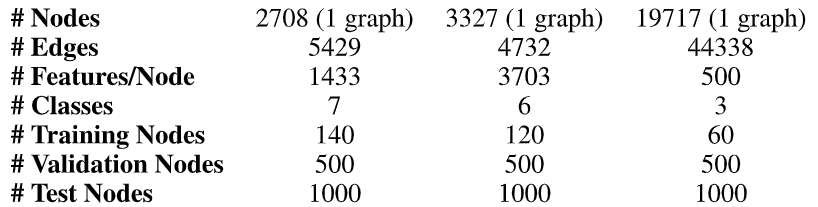

    We allow for only 20 nodes per class to be used for training—however, honoring the transductive setup, the training algorithm has access to all of the nodes' feature vectors. The predictive power of the trained models is evaluated on 1000 test nodes, and we use 500 additional nodes for validation purposes (the same ones as used by Kipf & Welling (2017)).
6.  什么叫transductive什么叫inductive？
7.  attention是仅对one-hop的点做的吗？
8.  GAT一定比GCN好吗？
9.  attention是复杂度是$O(N^2)$的，也就是说对于稠密子图的话attention的时间复杂度会很高？
10. 说了stacking layer的

    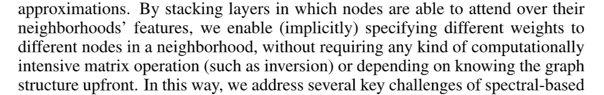

    为什么后面又只用了一层呢？transductive上是一层，inductive是两层，且inductive的第二层attention layer实际上用skip connection。
11. constGAT为什么效果这么好？

