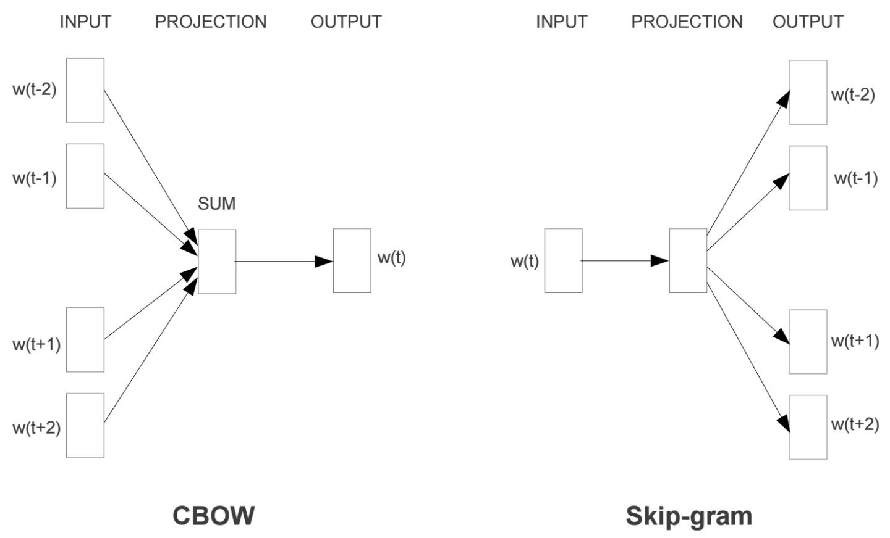
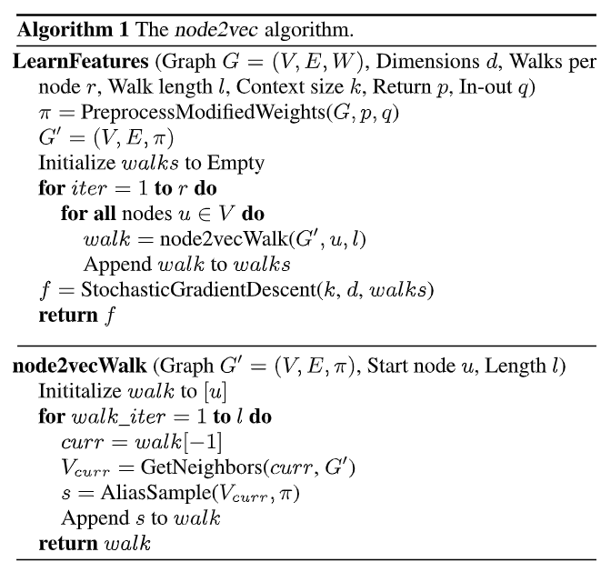
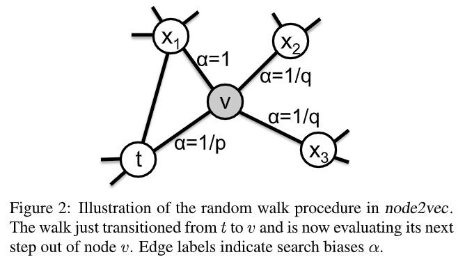
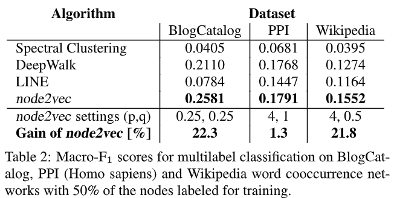
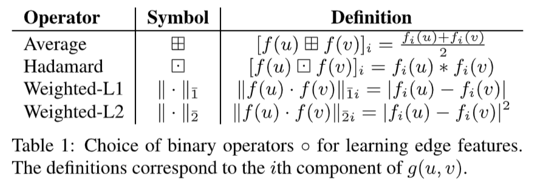
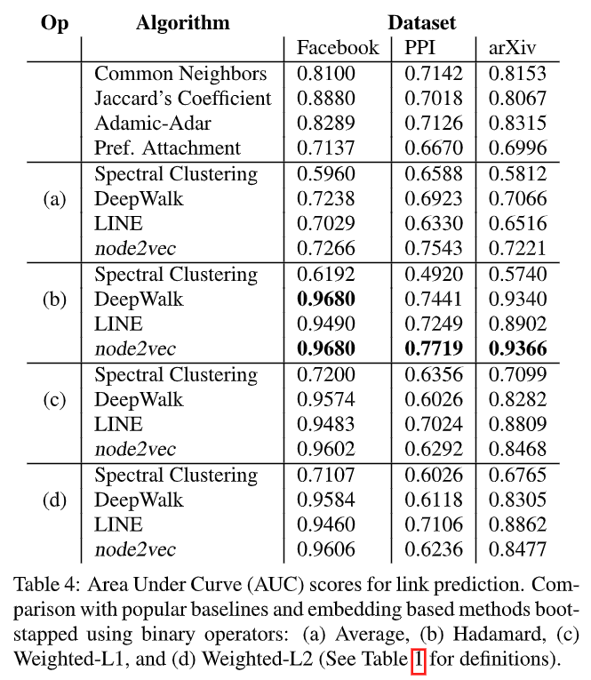
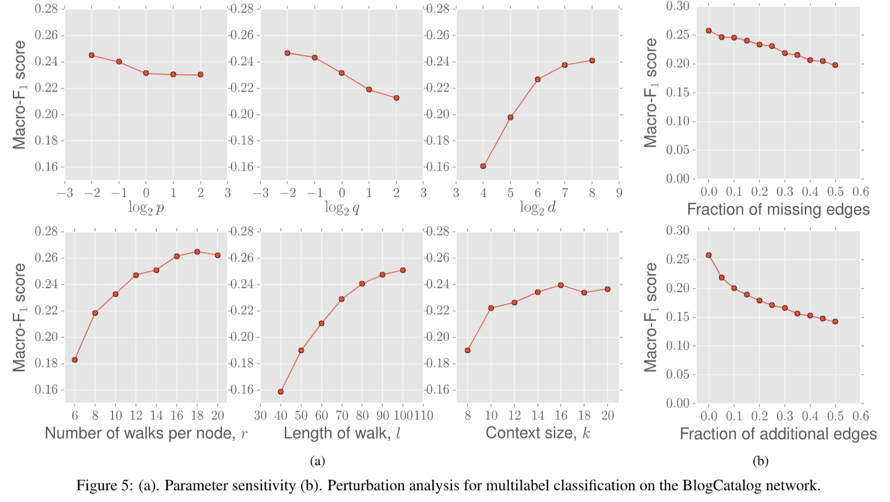
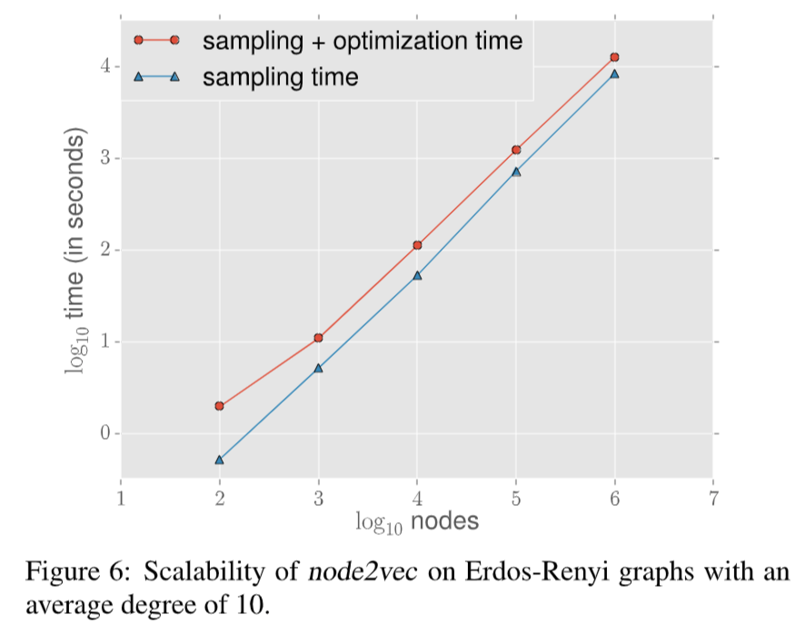

# node2vec

## 目录

-   [方法论](#方法论)
-   [实验结果1：多标签分类](#实验结果1多标签分类)
    -   [干什么](#干什么)
    -   [怎么做](#怎么做)
    -   [数据集](#数据集)
    -   [设置](#设置)
    -   [效果](#效果)
-   [实验结果2：预测缺失的边](#实验结果2预测缺失的边)
    -   [干什么](#干什么)
    -   [怎么做](#怎么做)
    -   [数据集](#数据集)
    -   [设置](#设置)
    -   [效果](#效果)
-   [敏感度分析](#敏感度分析)
-   [可伸缩性](#可伸缩性)
-   [结论](#结论)
-   [疑问](#疑问)

<http://snap.stanford.edu/node2vec/>

<https://zhuanlan.zhihu.com/p/56542707>

# 方法论

-   Node2Vec是一种在图（graph）中生成节点嵌入（node embeddings）的算法。在这种情况下，图是由节点（或顶点）和边组成的数据结构，其中边表示节点之间的关系。**"嵌入"是高维数据的低维表示**，它们尽可能地保留了原始数据的某些重要属性。
-   Node2Vec的主要目标是学习一个表示函数，该函数将图中的每个节点映射到一个连续向量空间中的一个点，这样相近的点在图论意义上是相似的。这意味着，**如果两个节点在图中彼此紧密相关（例如，它们之间有一条边，或者它们与许多共同节点相连），那么它们的嵌入应该是相似的**（很类似NLP中如果两个words的contexts如果相似，得到的embedding自然也是相似的，也是word2vec的工作原理）。
    -   需要最大化的目标
        $$
        \max _{f} \sum_{u \in V} \log \operatorname{Pr}\left(N_{S}(u) \mid f(u)\right)
        $$
    -   条件独立
        $$
        \operatorname{Pr}\left(N_{S}(u) \mid f(u)\right)=\prod_{n_{i} \in N_{S}(u)} \operatorname{Pr}\left(n_{i} \mid f(u)\right)
        $$
    -   对称性
        $$

        \operatorname{Pr}\left(n_{i} \mid f(u)\right)=\frac{\exp \left(f\left(n_{i}\right) \cdot f(u)\right)}{\sum_{v \in V} \exp (f(v) \cdot f(u))}
        $$
    -   实际优化目标
        $$
        \max _{f} \sum_{u \in V}\left[-\log Z_{u}+\sum_{n_{i} \in N_{S}(u)} f\left(n_{i}\right) \cdot f(u)\right]
        $$
    -   其中正则化项很难算
        $$
        Z_{u}=\sum_{v \in V} \exp (f(u) \cdot f(v))
        $$
        于是使用negative sampling的方式。
-   首先说了BFS和DFS并试图结合这两种算法的有点。这种算法的工作原理基于一种称为“随机游走”的方法，该方法在图中随机选择路径，生成一个节点序列。然后，它使用一个被称为Skip-gram的神经网络模型来**预测给定节点的邻居节点**。这种训练方式产生了一种能够捕获节点上下文（也就是其在图中的位置和邻居）的嵌入表示。

-   Node2Vec还引入了两个超参数，p和q，用来控制随机游走的方式。p参数控制游走是否倾向于**立即返回先前访问的节点**，而q参数控制游走是否倾向于**探索离当前节点更远的节点**。通过调整这两个参数，用户可以在保留节点的局部和全局结构之间找到平衡。
    -   定义转移概率
        $$
        P\left(c_{i}=x \mid c_{i-1}=v\right)=\left\{\begin{array}{ll}\frac{\pi_{v x}}{Z} & \text { if }(v, x) \in E \\ 0 & \text { otherwise }\end{array}\right.
        $$
    -   计算转移概率
        $$
        \pi_{v x}=\alpha_{p q}(t, x) \cdot w_{v x}
        $$
        其中
        $$
        \alpha_{p q}(t, x)=\left\{\begin{array}{ll}\frac{1}{p} & \text { if } d_{t x}=0 \\ 1 & \text { if } d_{t x}=1 \\ \frac{1}{q} & \text { if } d_{t x}=2\end{array}\right.
        $$
    -   如图

-   总的来说，Node2Vec的目标是生成一种表示，这种表示可以捕获图中节点的结构和上下文信息。这种表示可以用于许多任务，如**节点分类**、**链接预测**和**社区检测**等。

# 实验结果1：多标签分类

## 干什么

In the multi-label classification setting, every node is assigned **one or more labels from a finite set L**. During the training phase, we observe a certain fraction of nodes and all their labels. The task is to predict the labels for the remaining nodes. This is a challenging task especially if L is large. We utilize the following datasets:

## 怎么做

不晓得。

## 数据集

-   **BlogCatalog** \[38]: This is a network of social relationships of the bloggers listed on the BlogCatalog website. The labels represent blogger interests inferred through the metadata provided by the bloggers. The network has 10,312 nodes, 333,983 edges, and 39 different labels.
-   **Protein-Protein Interactions (PPI)** \[5]: We use a subgraph of the PPI network for Homo Sapiens. The subgraph corre- sponds to the graph induced by nodes for which we could obtain labels from the hallmark gene sets \[19] and repre- sent biological states. The network has 3,890 nodes, 76,584 edges, and 50 different labels.
-   \*\*Wikipedia \*\*\[20]: This is a cooccurrence network of words appearing in the first million bytes of the Wikipedia dump. The labels represent the Part-of-Speech (POS) tags inferred using the Stanford POS-Tagger \[32]. The network has 4,777 nodes, 184,812 edges, and 40 different labels.

## 设置

The parameter settings used for node2vec are in line with typical values used for DeepWalk and LINE. Specifically, we set $d = 128, r = 10, l = 80, k = 10$, and the optimization is run for a single epoch. We repeat our experiments for **10 random seed initializations**, and our results are statistically significant with a **p-value of less than 0.01**. The best in-out and return hyperparameters were learned using **10-fold cross-validation on 10% labeled data** with a **grid search** over $p, q ∈ {0.25, 0.50, 1, 2, 4}$.

## 效果

# 实验结果2：预测缺失的边

## 干什么

In link prediction, we are given a network with a certain fraction of edges removed, and we would like to predict these missing edges. We generate the labeled dataset of edges as follows: To obtain positive examples, we remove 50% of edges chosen randomly from the network while ensuring that the residual network obtained after the edge removals is connected, and to generate negative examples, we randomly sample an equal number of node pairs from the network which have no edge connecting them.

## 怎么做

通过embedding之间的范数或者求均值等等计算距离score用于预测缺失的边（我知道大概思路但具体不会写hh）。

## 数据集

-   **Facebook** \[14]: In the Facebook network, nodes represent users, and edges represent a friendship relation between any two users. The network has 4,039 nodes and 88,234 edges.
-   \*\*Protein-Protein Interactions (PPI) \*\*\[5]: In the PPI network for Homo Sapiens, nodes represent proteins, and an edge indicates a biological interaction between a pair of proteins. The network has 19,706 nodes and 390,633 edges.
-   **arXiv ASTRO-PH** \[14]: This is a collaboration network generated from papers submitted to the e-print arXiv where nodes represent scientists, and an edge is present between two scientists if they have collaborated in a paper. The network has 18,722 nodes and 198,110 edges.

## 设置

为了简洁没写。

## 效果

# 敏感度分析

# 可伸缩性

The sampling procedure comprises of preprocessing for computing transition probabilities for our walk (negligibly small) and simulation of random walks. The optimization phase is made efficient using negative sampling \[22] and asynchronous SGD \[26].

-   毕竟论文题目里有这个词，拿来讨论以下好了。
-   在随机图上进行试验，测试sampling time，结果在log-log下线性。
-   算法时间复杂度$\mathcal{K}=r \cdot l \cdot|V|$

<https://www.cnblogs.com/orion-orion/p/16254923.html>

# 结论

-   For instance, we observed that BFS can **explore only limited neighborhoods**. This makes BFS suitable for characterizing **structural equivalences** in network that rely on the immediate local structure of nodes. On the other hand, DFS can freely **explore network neighborhoods which is important in discovering homophilous communities at the cost of high variance**.
-   Both DeepWalk and LINE can be seen as rigid search strategies over networks. DeepWalk \[24] proposes search using **uniform random walks**. The obvious limitation with such a strategy is that it gives us no control over the explored neighborhoods. LINE \[28] proposes primarily a **breadth-first strategy**, sampling nodes and optimizing the likelihood independently over only 1-hop and 2-hop neighbors. The effect of such an exploration is easier to characterize, but it is restrictive and provides no flexibility in exploring nodes at further depths. In contrast, the search strategy in node2vec is both flexible and controllable exploring network neighborhoods through parameters p and q. While these search parameters have intuitive interpretations, we obtain best results on complex networks when we can learn them directly from data. From a practical standpoint, **node2vec is scalable and robust to perturbations**.
-   We showed how extensions of node embeddings to link prediction outperform popular heuristic scores designed specifically for this task. Our method permits additional binary operators beyond those listed in Table 1. As a future work, we would like to explore the reasons behind **the success of Hadamard operator over others**, as well as establish interpretable equivalence notions for edges based on the search parameters. Future extensions of node2vec could involve networks with special structure such as heterogeneous information networks, networks with explicit domain features for nodes and edges and signed-edge networks. Continuous feature representations are the backbone of many deep learning algorithms, and it would be interesting to **use node2vec representations as building blocks for end-to-end deep learning on graphs**.

# 疑问

-   如何理解homophilous 和structural equivalences？
-   为什么论文说node2vec是半监督的？
-   怎样初始化embedding的？
-   怎么把embedding应用到下游任务中（我的理解是这只是一个中介算法，后面怎么做没讲）
    -   怎么做多标签分类的，code里没有？
    -   怎么预测缺失的边，code里没有？
-   为什么说BFS只能看1hop的点，消息难道不能传递吗？
-   在$N_{S}(u) \subset V$中，我们通过$S$采样得到序列，那么$N_{S}(u)$仅代表1hop的点还是后续的所有neighbor的点
-   为什么以及怎么做负例的negative sampling的？

    In the optimization phase, all these benchmarks optimize using SGD with two key differences that we correct for. First, DeepWalk uses **hierarchical sampling** to approximate the softmax probabilities with an objective similar to the one use by node2vec. However, hierarchical softmax is inefficient when compared with negative sampling \[22]. Hence, keeping everything else the same, we switch to negative sampling in DeepWalk which is also the de facto approximation in node2vec and LINE.
-   SGD的梯度计算式是啥，对谁求导？
-   有没有基于pytorch的版本让我跑一跑代码？
-   怎么在图上划分训练集/验证集/测试集？
-   这里用SGD的话Adam可不可以用，效果怎么样？
